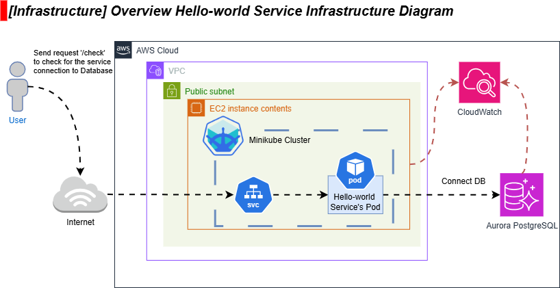
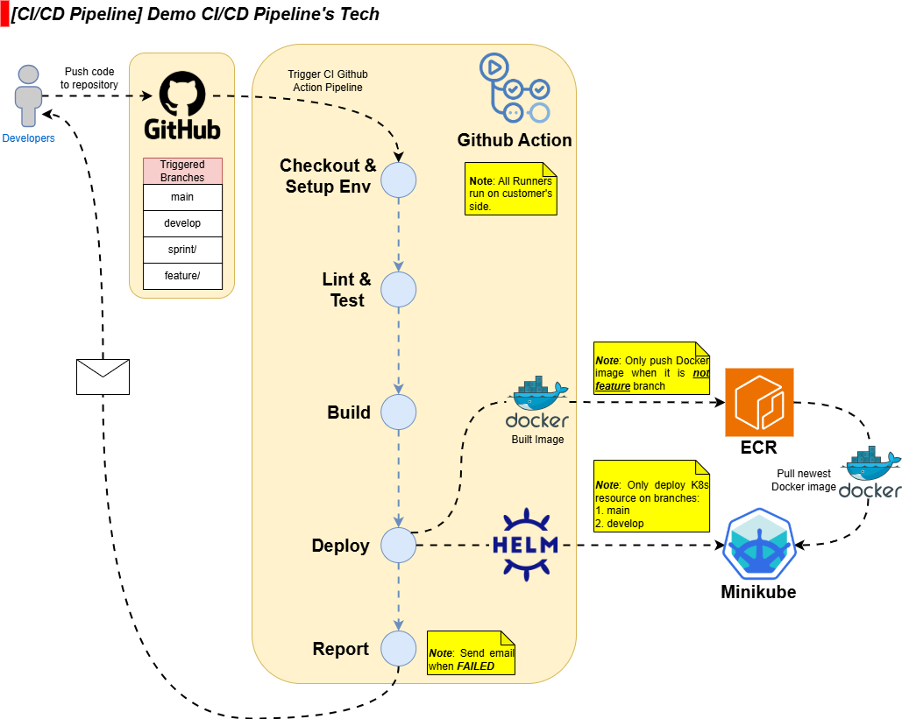
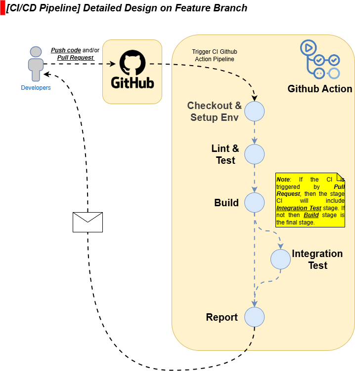

# 1. Github Action CI/CD Pipeline Design & Implementation
Demo Project for CI/CD pipeline with Github Action for anh L.V.Duy

- [1. Github Action CI/CD Pipeline Design \& Implementation](#1-github-action-cicd-pipeline-design--implementation)
  - [1.1. Version History](#11-version-history)
  - [1.2. System Requirements](#12-system-requirements)
    - [1.2.1. **Git branching Strategy:**](#121-git-branching-strategy)
    - [1.2.2. **Hosting Gitlab Runner:**](#122-hosting-gitlab-runner)
    - [1.2.3. **Web Application and Infrastructure Architecture:**](#123-web-application-and-infrastructure-architecture)
    - [1.2.4. **Main Programming Language and Framework:**](#124-main-programming-language-and-framework)
    - [1.2.5. **External CI tool:**](#125-external-ci-tool)
    - [1.2.6. **Container Registry:**](#126-container-registry)
    - [1.2.7. **Deployment Tech:**](#127-deployment-tech)
    - [1.2.8. **Build Notification:**](#128-build-notification)
  - [1.3. Design and Rationale](#13-design-and-rationale)
    - [1.3.1. Overview on the `hello-world` Mircoservice](#131-overview-on-the-hello-world-mircoservice)
    - [1.3.2. Overview CI/CD Pipeline design](#132-overview-cicd-pipeline-design)
    - [1.3.3. Features for `feature/**` branch](#133-features-for-feature-branch)
  - [1.4. Implementation](#14-implementation)
    - [1.4.1. Workflows for `feature/**` branch](#141-workflows-for-feature-branch)

## 1.1. Version History

| Version | Release Date | Changes & Updates                        | Author    | Reviewer  | Status    |
|---------|--------------|------------------------------------------|-----------|-----------|-----------|
| v0.0.3  | 20 June 2025 | 1st requirement (**1.2.1** to **1.2.8**) | L.H.Thinh | L.V.Duy   | Review    |
|         |              | Draft Design (**1.3.1** to **1.3.3**)    |           |           | Review    |
|         |              | CI/CD Implemetation (**1.4.2**)          |           |           | Review    |

## 1.2. System Requirements

### 1.2.1. **Git branching Strategy:**
The main git branching shall be Git Flow with notable branches:
- `main`:       (**Open Point**: Production ready code and should deploy to production manually or automatically?)
- `develop`:    (**Open Point**: Do CD deploy to a dev environment on the same cluster but difference namespace)
- `sprint/`:    (**Open Point**: What does this branch contain? Is the same with `release` branch)
- `feature/`:   (**Open Point**: Should it be triggered every pushes & pull requests? What should be the different notable feature between **Push trigger** and **PR trigger**)

and more

### 1.2.2. **Hosting Gitlab Runner:**
The main Github Runner shall be provided by the customer (**Open point**: 100% CI build shall be built on customer's )

### 1.2.3. **Web Application and Infrastructure Architecture:**
The web application architecture currently is microservices, the microservice should use the technology such as:
- The programming language and framework for backend (check **1.2.4. Main Programming Language and Framework**)
- Connect to the database: AWS ***Aurora PostgreSQL***
- The metrics and logs should be monitored by AWS ***CloudWatch***

### 1.2.4. **Main Programming Language and Framework:**
The main tech framework:
- Frontend: Angular
- Backend: Java (**Open Point**: Spring Boot?)

### 1.2.5. **External CI tool:**
None

### 1.2.6. **Container Registry:**
Elastic Container Registry (AWS)

### 1.2.7. **Deployment Tech:**
Self-written Helm and deploy to EKS

### 1.2.8. **Build Notification:**
After CI build fails, an email should be sent

## 1.3. Design and Rationale

### 1.3.1. Overview on the `hello-world` Mircoservice

Based on the requirements:
- **With requirement for [Deployment Technology](#127-deployment-tech)**:
  - As EKS is costly for the demo, the technology will be modified for the implementation
  - ***For this demo***, will use __Minikube__ for testing purpose
- **With requirement for [Architecture](#123-web-application-architecture)**: 
  - AWS services to be used: Aurora PostgreSQL, CloudWatch, EC2
  - The Minikube cluster should be deployed in the EC2 instance for testing
  - User request to the Server with the path `/check` should return the DB connection status

Basic network request flow:
- Request `/` and response `Hello world, welcome to <POD-ID>` if the request is received by the deployed pod
- Request `/check` and response `DB connnected` if connection to DB is successful
- Request `/check` and response `DB NOT connnected` if connection to DB fails

### 1.3.2. Overview CI/CD Pipeline design

Based on the collected requirements below, the rationale for the designed CI/CD pipeline shall be as below:
- **With requirement for [Git Strategy](#121-git-branching-strategy)**:
  - CI/CD build will be triggered every push to repository
  - CI/CD will have basic four stages: 
    - __Checkout & Setup Env__: Checkout code Setup Environments, install and cache Dependencies
    - __Lint & Test__: Testing for bug and check for coding style rule
    - __Build__: Build Artifact like Java package and Docker image for the stage __Deploy__ 
    - __Deploy__: Push to ECR and Deploy to K8s environment (if necessary). (**Open point**: Which branch should have Deploy stage)
    - __Report__: Will report what failed and send the email to the Developer if the CI build fails.
- **With requirement for [Runner](#122-hosting-gitlab-runner)**: 
  - No need to create self-host Runner for normal CI/CD build.
  - ***For this demo***, will use __Gitlab-provided Runner__
- **With requirement for [Architecture](#123-web-application-architecture)**: 
  - The template for CI/CD should be reusable for all microservices (if possible)
- **With requirement for [Language and Framework](#124-main-programming-language-and-framework)**:
  - The package management needed for the CI/CD's Backend will likely be Maven version (**Open point**: which version of Maven to use?)
  - The package management needed for the CI/CD's Frontend will likely be NodeJS (**Open point**: which version of NodeJS to use?)
- **With requirement for [Container Registry](#126-container-registry)**:
  - The __Deploy__ stage will need to have an ECR credential for access. 
  - Github Secret have to be created.
- **With requirement for [Deployment Technology](#127-deployment-tech)**:
  - Helm shall be used for automatic deployment and integrated to the CI/CD build.
- **With requirement for [Notification](#128-build-notification)**:
  - When an CI/CD fail, the notification shall be sent to the email
  - ***For this demo***, will use personal __Gmail__ for notification

### 1.3.3. Features for `feature/**` branch

- **Checkout & Setup Env**
  - Checkout the latest commit of the triggered commmit (with the ***shallow fetch depth of 1*** to save the time and space).
  - Setup JDK for Java Backend Application and cache dependency `.m2` for multiple GitHub Action's Jobs between builds to reduce execution time
 
- **Lint & Test**
  - Running Unit Test with the `mvn verify`
  - (**Open point**: )

- **Build**
  - Compile code and package it as a deployable artifact (e.g., a JAR/WAR file for Java projects).
  - Generate a Docker image using a Dockerfile. Tag the image with branch name and commit SHA to ensure traceability.

- **Integration Testing:**
  - Should only run if the triggered event is pull request
  - Testing by sending API Request to check for response
  - The service should connect with the DB, with the  

## 1.4. Implementation

### 1.4.1. Workflows for `feature/**` branch
Check `.github/workflows/feature_workflows.yml` 